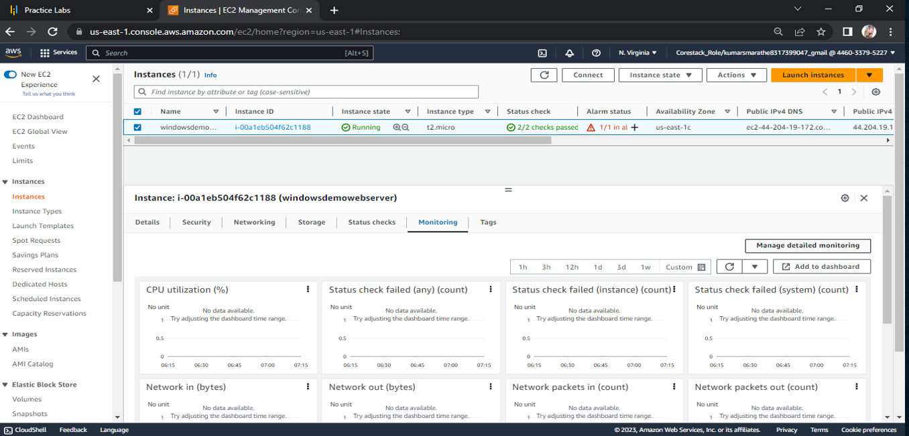
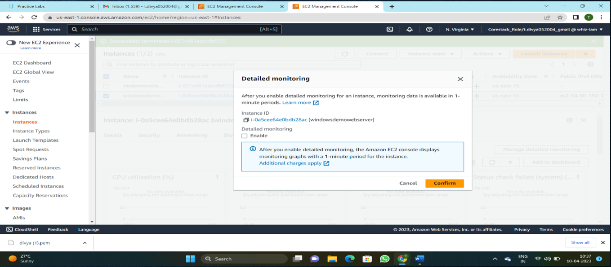
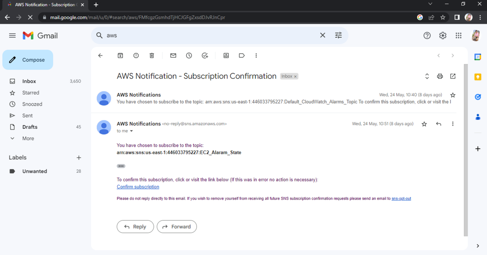
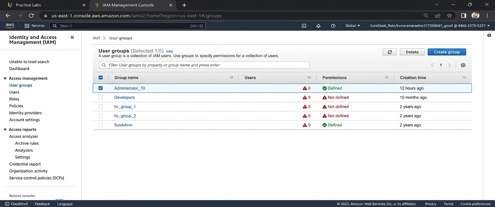
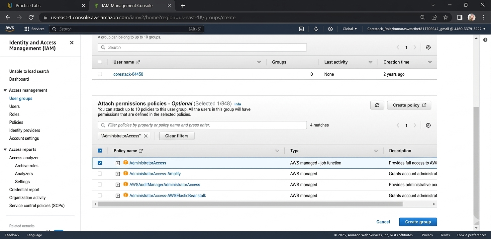
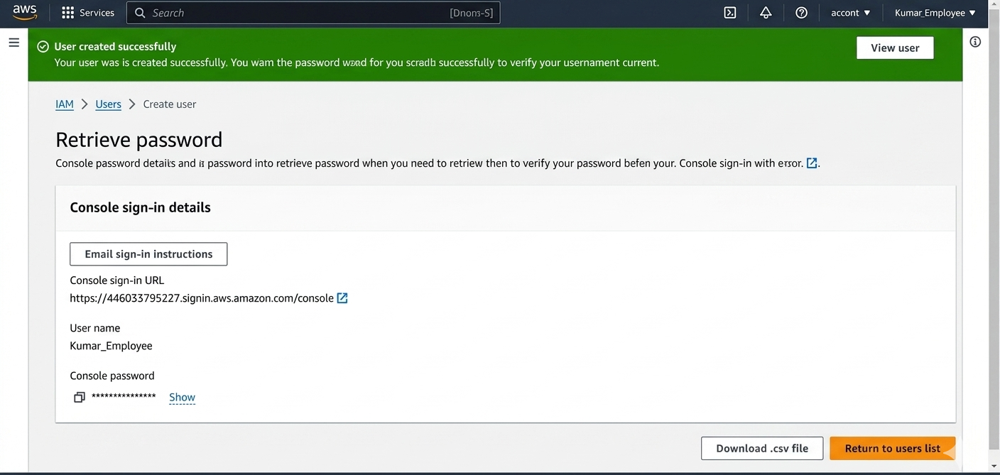

# ☁️ AWS EC2 Server Monitoring — Project

Project that walks through a real AWS workflow: launching an **EC2** instance, monitoring it with **CloudWatch**, configuring **Alarms + SNS** notifications, and locking down access with **IAM** groups/users. Using console steps and includes real screenshots from the setup.

## 📌 Overview

This project demonstrates the end-to-end lifecycle of monitoring an EC2 server on AWS:

1. **Launch** an EC2 instance
2. **Monitor** it using CloudWatch metrics (CPU, Network, Status Checks)
3. **Alert** on thresholds via CloudWatch Alarms + SNS email notifications
4. **Secure** access using least-privilege IAM groups and users

 A Chart.js-powered CPU utilization graph, and screenshots captured directly from the AWS Console during the build.

---

## 🖥️ Pages

| Page | Description |
|---|---|
| `index.html` | Landing page — project overview and how to navigate the demo |
| `ec2.html` | EC2 instance creation steps (AMI, instance type, VPC/Subnet/Security Group, Key Pair) |
| `monitoring.html` | CloudWatch metrics explained + live Chart.js CPU utilization chart |
| `alarms.html` | CloudWatch Alarms configuration and SNS email notification setup |
| `iam.html` | IAM group/user creation for least-privilege, read-only monitoring access |

---


## 🚀 What This Project Covers

### 1. EC2 Instance Setup
- Choosing an AMI (Amazon Linux 2023)
- Selecting instance type (`t3.micro` / `t2.micro`)
- Configuring VPC, Subnet, and Security Group rules
- Creating a Key Pair for SSH access
- Verifying instance status checks




### 2. CloudWatch Monitoring
- Key metrics tracked: `CPUUtilization`, `NetworkIn/Out`, `StatusCheckFailed`
- Dashboard widgets for CPU, Network, Status Checks, and CPU Credit Balance
- Best practices: matching metric period/resolution, `TreatMissingData=notBreaching`, tagging for dashboard filters


### 3. Alarms & SNS Notifications
- `CPUUtilizationHigh`: triggers when average CPU > 80% for 5 minutes
- `StatusCheckFailedAny`: triggers when max > 0 for 10 minutes
- SNS topic (e.g. `EC2MonitoringTopic`) with email subscription + confirmation



### 4. IAM Groups & Users
- Created a `MonitoringViewers` group with the `CloudWatchReadOnlyAccess` policy
- Added a user to the group with console access (no admin permissions)
- Enforced least-privilege access with MFA recommended





---


## 📁 Folder Structure

```
project/
│── index.html
│── ec2.html
│── monitoring.html
│── alarms.html
│── iam.html
│
├── css/
│   └── styles.css
│
├── js/
│   ├── main.js
│   └── charts.js
│
└── images/
        ├── cloud-watch-monitoring
        ├── CloudWatch-Monitoring-CPU,Network-Status-Checks
        ├── picture1.png
        ├── picture2.png
        ├── picture4.png
        ├── iam1.png
        ├── iam2.png
        └── iam3.png
```

---


## ✨ Features

- Live CPU utilization chart via Chart.js
- Real AWS Console screenshots for EC2, CloudWatch, Alarms/SNS, and IAM steps

---

## 🎯 Purpose

Created to demonstrate practical AWS infrastructure fundamentals — EC2, CloudWatch, Alarms/SNS, and IAM 
---

## Author

This project is maintained by **Kumar S Marathe**

📧 Connect with me:
- GitHub: [github.com/kumarsm9130](https://github.com/kumarsm9130)
- LinkedIn: [linkedin.com/in/kumar-s-marathe-79a163256](https://www.linkedin.com/in/kumar-s-marathe-79a163256/)
